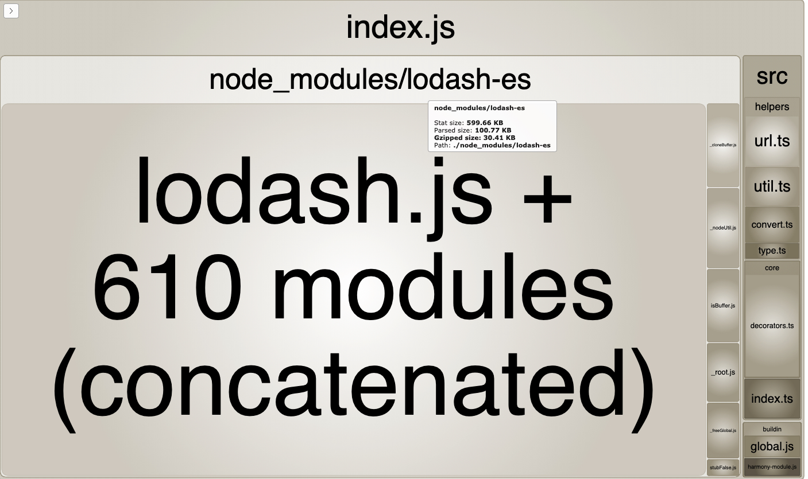
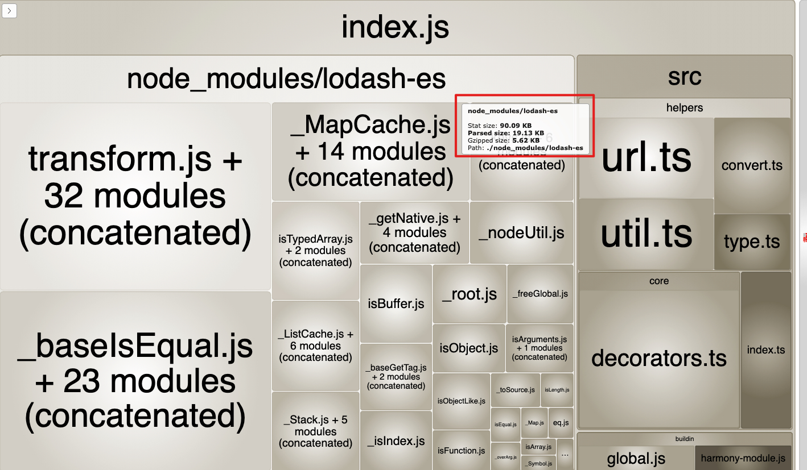

# JS体积优化

### 一、使用了 lodash （30.41kb）

由于使用 lodash 的比较函数，gzip 多了 30.41kb

### 二、使用 lodash-es 优化 （5.62kb）

lodash 按需引入，从 30.41kb 降到 5.62kb

Ref: https://itnext.io/lodash-es-vs-individual-lodash-utilities-size-comparison-676f14b07568

Ref: https://stackoverflow.com/questions/1068834/object-comparison-in-javascript

### 三、不用 lodash （0.5kb）

[deepEqual](./src/helpers/deepEqual.ts)，只需要 0.5kb
