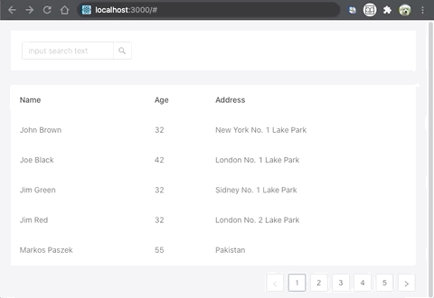

<div align="center">
  <h1>sync-query</h1>

  ❄️

  Use the React higher-order component to synchronize the React State and routing parameters
</div>

<hr />

<!-- 使用 React 高阶组件，实现 React state 和 路由参数之间的同步 -->

## Demo




^_^ This is demo of using sync-query in antd-design.

There is only three lines of code.

```js
// import
import { syncQueryHOC } from "sync-query";
// use syncQueryHOC
const MyComponentEnhance = syncQueryHOC(MyComponent, ['searchInput', 'pagination'], 'fetch');
<MyComponentEnhance></MyComponentEnhance>
//...
```

[More about the Demo](https://github.com/NeoYo/sync-query/tree/master/examples/antd/antd-demo)

Once we did this, there are powerful features below.

## Feature

- auto synchronize react state to url query (URLSearchParam)
- auto call 'fetch' if react state is detected change.
- auto init react react state from url query (URLSearchParam)

## Installation(安装)

`yarn add sync-query`

`npm i --save sync-query`

## Usage(使用说明)

### Use TypeScript Decorator

```typescript
import { SyncQueryFactory, syncQueryCb } from "sync-query";

@SyncQueryFactory(['searchInput', 'pagination']) // 监听到 searchInput 或 pagination 变化时同步到 URL query
export class MyComponent extends Component {
    this.state = {
        searchInput: 'hello world',
        pagination: {
        },
    }
    @syncQueryCb(['searchInput']) // 监听到 searchInput 变化时调用 fetch 函数
    fetch() {
        // network fetch...
    }
}
```

### Use ES6 React HOC

``` js
import { syncQueryHOC } from "sync-query";

export class MyComponent extends Component {
    fetch() {
        // network fetch...
    }
}

export const MyComponentEnhance = 
    syncQueryHOC(
        MyComponent,
        ['searchInput', 'pagination'], // 监听到 searchInput 或 pagination 变化时同步到 URL query
        'fetch',
        {
            callbackDeps: ['searchInput'], // 监听到 searchInput 变化时调用 fetch 函数
            wait: 600, // 函数防抖，600ms
        }
    );
```

> 注意: SyncQueryFactory 装饰器工厂 和 syncQueryHOC 要放在离 MyComponent 最近的位置

## API

### syncQueryHOC

接收一个 React 组件，返回带有同步 state 到路由参数功能的组件

syncQueryHOC(WrappedComponent, stateList: string[], callbackName?:string, config?:SyncQueryConfig): EnhanceComponent

- WrappedComponent: 被装饰的原始组件
- stateList: 传一个数组，state 中对应 key 的值会被监听
- callbackName?: 监听到变化时，触发 effect 方法
- config?: SyncQueryConfig
    ```typescript
    type SyncQueryConfig = {
        wait: number,                           // 函数防抖的等待时间， 单位 ms
        callbackDeps?: string[],                // callbackDeps 存放 state key 的数组，监听到 state 中对应key 的 value 变化时，会调用 callback（网络请求等）
                                                // callbackDeps 没有传入时，默认监听的内容等于 stateList
        parser?: IQueryParser,                  // 解析器：用于将路由参数 query 解析到 state，默认是 JSON.parse
        stringify?: IQueryStringify,            // 生成器：用于生成 state 对应的 query 字符串，默认是 JSON.stringify
    }
    ```

### SyncQueryFactory

SyncQueryFactory 装饰器工厂， 在 typescript 中使用

SyncQueryFactory(stateList: string[], callbackName?:string, config?:SyncQueryConfig) 

> 注意 类装饰器工厂 SyncQueryFactory 和 方法装饰器 syncQueryCb 可以配合使用， 高阶组件 syncQueryHOC 与前两者尽量避免共用。

- stateList: 传一个数组，state 中对应 key 的值会被监听
- callbackName?: 监听到变化时，触发 effect 方法
- config?: SyncQueryConfig
    ```typescript
    type SyncQueryConfig = {
        wait: number,                           // 函数防抖的等待时间， 单位 ms
        callbackDeps?: string[],                // callbackDeps 存放 state key 的数组，监听到 state 中对应key 的 value 变化时，会调用 callback（网络请求等）
                                                // callbackDeps 没有传入时，默认监听的内容等于 stateList
        parser?: IQueryParser,                  // 解析器：用于将路由参数 query 解析到 state，默认是 JSON.parse
        stringify?: IQueryStringify,            // 生成器：用于生成 state 对应的 query 字符串，默认是 JSON.stringify
    }
    ```

代码实现如下：

```typescript
function SyncQueryFactory(stateList: string[], callbackName?:string, config?:SyncQueryConfig) {
    return function(WrappedComponent) {
        return syncQueryHOC(WrappedComponent, stateList, callbackName, config);
    }
}
```

### syncQueryCb

syncQueryCb 方法装饰器，与 SyncQueryFactory 配合使用

syncQueryCb(callbackDeps?:string[])

- callbackDeps?: string[]  callbackDeps 存放 state key 的数组，监听到 state 中对应key 的 value 变化时，会调用 callback（网络请求等）

使用示例： 

```typescript
import { SyncQueryFactory, syncQueryCb } from "sync-query";

@SyncQueryFactory(['searchInput', 'pagination']) // 监听到 searchInput 或 pagination 变化时同步到 URL query
export class MyComponent extends Component {

    @syncQueryCb(['searchInput']) // 监听到 searchInput 变化时调用 fetch 函数
    fetch() {
        // network fetch...
    }
}
```

## License

MIT
